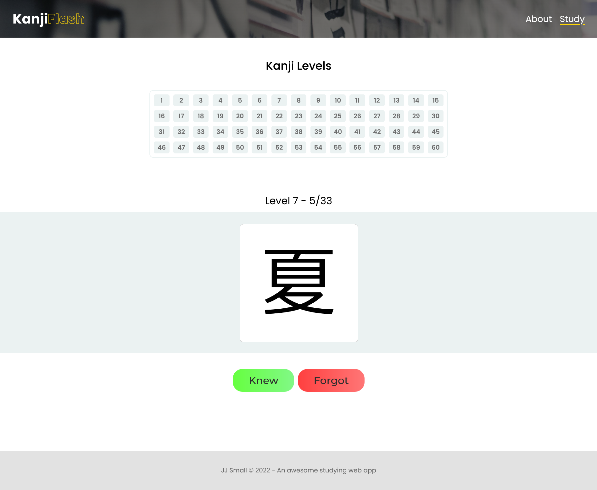

# Kanji Flash
A simple and clean kanji flashcard web app

[Visit the site](https://jjsmall009.github.io/kanji-flash/).

## Overview
The goal of this web app is to provide a straightforward platform for rapidly studying all 60 levels of kanji from WaniKani.

Wanikani uses it's own SRS (spaced repetition system) to facilitate learning but I've found it useful to go back to older kanji and refresh myself on them by just running through flashcards.

There's no built-in way to do this on WaniKani so thus Kanji Flash was born.

## To-do
- [x] Make a proper readme
- [x] Do some layout sketches on Figma
- [x] Brainstorm feature set and website structure
- [x] Get kanji data from WaniKani (JSON most likely)
- [x] Build the level picker section and add functionality 
- [x] Create flashcard queue and answer button functionality 
- [x] Clean up code and CSS
- [x] Mobile css